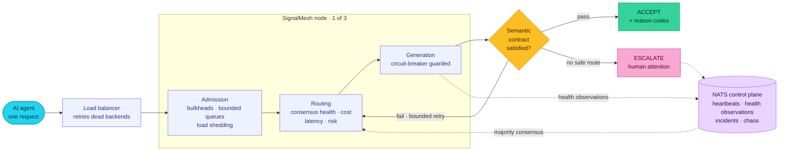
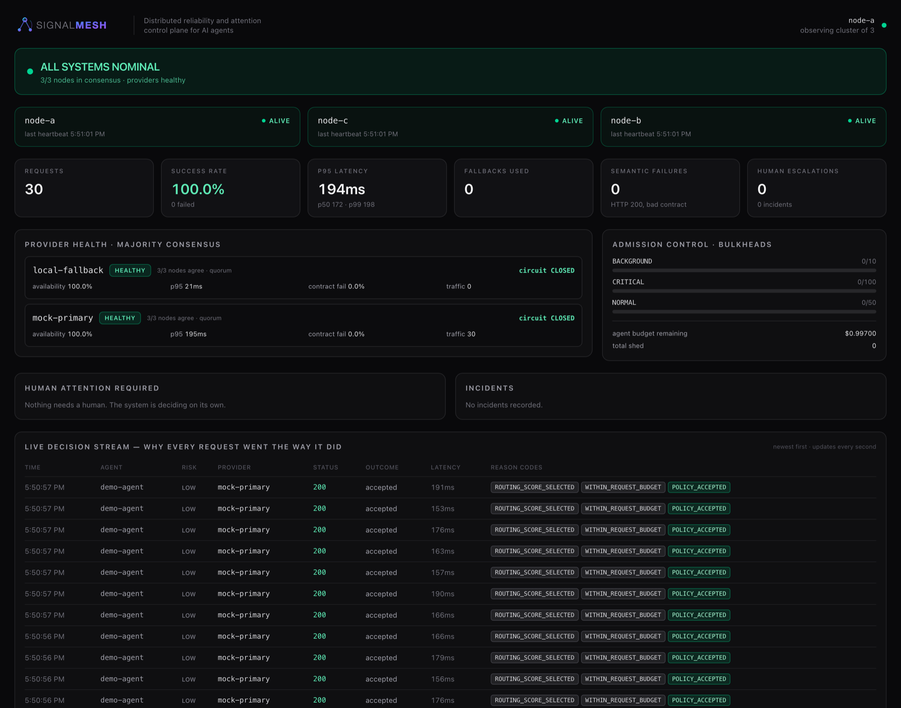
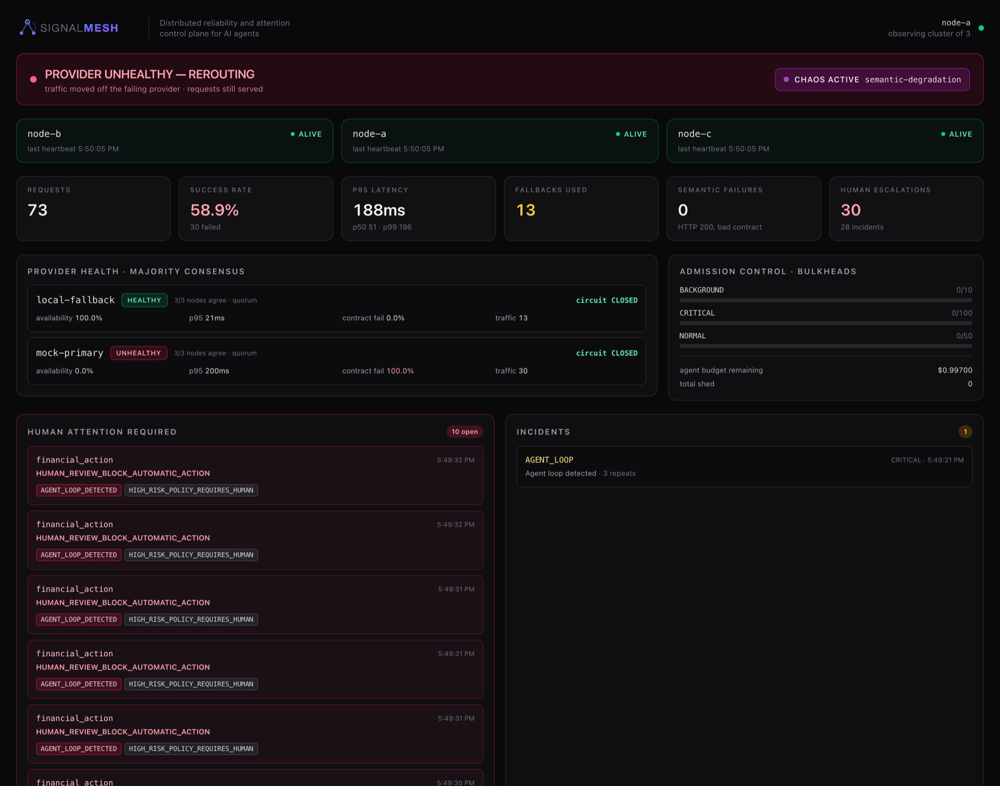

<div align="center">


**The distributed reliability and attention control plane for AI agents.**

*Signal Labs Hackathon 2026 — **Distributed Systems** track*

### ▶ [Watch the demo](https://youtu.be/s9anCsTpBRY)

[Architecture](#architecture) · [Benchmarks](docs/benchmarks.md) · [Chaos scenarios](scenarios/README.md) · [Judge Q&A](docs/judge-qa.md)

</div>

---

## The problem

Traditional infrastructure asks: *"Is the service up?"*
AI infrastructure has to ask: *"Is this dependency healthy enough for **this**
request, at **this** cost, with **this** level of risk?"*

A provider can return **HTTP 200** while:

- returning malformed or contract-violating structured output,
- producing low-confidence output,
- becoming dramatically slower or more expensive,
- driving an agent into a runaway retry loop that burns real money.

**HTTP success ≠ AI success.** Every health check in production today answers the
wrong question.

## The solution

Three independent Go nodes gossip over NATS, reach **majority health consensus**
on every provider, and decide — deterministically, per request — whether to
**accept, retry, fall back, or escalate to a human**, emitting a machine-readable
reason code at every stage.

| Axis | Question | Mechanism |
|---|---|---|
| Availability | Can it respond? | active probes + circuit breakers |
| Performance | Within the latency budget? | p95 vs policy, routing penalty |
| Economics | Within the cost/token budget? | per-request / per-agent / global budgets |
| Quality | Does the output satisfy the contract? | deterministic semantic validation |
| Reliability | Do the nodes *agree* it's healthy? | majority health consensus over NATS |
| Risk | Is this a safe route for this task? | policy-aware deterministic scoring |
| Attention | Should a human decide? | explainable escalation |

## Architecture

One request enters. Admission control protects the node, deterministic scoring
picks a provider from *consensus* health, the response is validated against a
semantic contract, and the request is accepted, rerouted, or escalated — with a
reason code at every step. Three nodes, no leader, no human in the loop.



**Why this shape.** The gate in the middle is the whole thesis: the provider
already returned HTTP 200 before we get there. Everything left of it is
*deciding who to ask*; everything right of it is *deciding whether to believe the
answer*. Traditional gateways stop at the load balancer.

Full component breakdown: [`docs/architecture.md`](docs/architecture.md).

## The control plane, live

Steady state — three nodes in consensus, both providers healthy, and every
request in the decision stream carrying the reason codes that produced it.



The same board mid-failure. `mock-primary` is returning **HTTP 200** with a
contract-violating body: consensus marks it `UNHEALTHY` at **100% contract
failure**, traffic reroutes to the zero-cost fallback, and an agent stuck
retrying a high-risk `financial_action` has been stopped and escalated —
`HUMAN_REVIEW_BLOCK_AUTOMATIC_ACTION`, not a guess.



Note what did **not** move: all three nodes still alive, quorum intact, and
critical/normal bulkheads untouched at `0/100` and `0/50`. The failure is
contained to the provider that caused it.

## Reason codes — every decision is explainable

No black box. Every response carries `X-SignalMesh-Provider`,
`X-SignalMesh-Phase`, `X-SignalMesh-Fallback`, and `X-SignalMesh-Reasons`.

| Reason code | Means |
|---|---|
| `SEMANTIC_VALIDATION_FAILED` | HTTP 200, but the body violated the response contract |
| `CONTRACT_FAILURE_RATE_HIGH` | This provider is *systematically* returning bad structure |
| `AGENT_LOOP_DETECTED` | Same request fingerprint failing repeatedly — stopped |
| `RUNAWAY_RETRY_STOPPED` | Cost containment kicked in before the bill did |
| `HUMAN_ATTENTION_REQUIRED` | No safe automated path; a person must decide |
| `GLOBAL_LOAD_SHEDDING` | Node near capacity — non-critical traffic shed, critical preserved |
| `ZERO_COST_PROVIDER` | Routed to the free local path to preserve budget |
| `HIGH_RISK_FALLBACK_PENALTY` | Fallback exists but is *not* trusted for this risk level |

## What is real (and what is simulated)

This is a one-day hackathon prototype. We are explicit about the boundary —
being caught hand-waving costs more than the disclosure does.

| Real, running code | Simulated / stubbed for demo reproducibility |
|---|---|
| 3-node cluster, NATS gossip, heartbeats, majority health consensus, node-failure detection | **Provider upstream**: `internal/providers/mock.go` is a deterministic simulator. Failure *modes* are modelled faithfully — 200-with-broken-contract, latency inflation, hard 5xx — but it is not a live OpenAI/Anthropic endpoint. |
| Deterministic routing/scoring, circuit breakers, admission control (bulkheads, bounded queues, load shedding) | **Local fallback**: calls Ollama if `OLLAMA_URL` is set and reachable, otherwise returns a deterministic static answer so the demo never depends on a GPU. |
| Semantic contract validation, agent-loop detection, budget governance, human-attention escalation | **State**: budgets, loop state, decision log, incidents are **in-memory / node-local**. Postgres + Redis are provisioned for the durable-audit / shared-state design but are not on the request path today. |
| Chaos engine, Prometheus metrics, live dashboard, load-generator benchmarks | |

Real provider connectors are one `Provider` interface implementation away
(`internal/providers/types.go`) — deliberately out of scope for a one-day build
focused on the *reliability control plane*, not the connectors.

## Measured results

Real numbers from `make benchmark` — the Go load generator driving the live
3-node cluster through the load balancer. Nothing invented.

| Load | Result |
|---|---|
| 1000 requests @ 50 concurrent, baseline | **100% success**, p95 200 ms — flat tail from c1 to c50 |
| 100 requests during a **total provider outage** | **100% success**, p95 56 ms, every request served by the zero-cost fallback |

Flat p95 from 1 → 50 concurrent means the entire pipeline — admission, scoring,
validation, breakers — adds no measurable tail latency. Full tables and
reproduction steps: [`docs/benchmarks.md`](docs/benchmarks.md). Raw JSON:
[`docs/benchmark-results/`](docs/benchmark-results/).

## Quickstart

```bash
make setup                 # pull images, build Go, install dashboard deps
make infra                 # start NATS
./scripts/dev-cluster.sh   # 3 nodes (:8080/:8081/:8082) + load balancer (:9000)
make dashboard             # http://localhost:3000
```

Send a request:

```bash
curl -si localhost:9000/v1/chat/completions -H 'Content-Type: application/json' -d '{
  "messages":[{"role":"user","content":"Capital of France?"}],
  "task_type":"qa","risk_level":"low","agent_id":"demo"
}' | grep -i 'x-signalmesh'
```

## Break it yourself

Every failure mode is **one endpoint call** that **auto-restores**. No terminal
juggling, no manual process kills.

```bash
make chaos SCENARIO=semantic-degradation   # HTTP 200 with a broken contract
make chaos SCENARIO=provider-outage        # circuit opens → zero-cost fallback
make chaos SCENARIO=node-failure           # a node stops heartbeating
make chaos SCENARIO=traffic-spike          # bulkheads shed non-critical load
make chaos SCENARIO=agent-loop             # runaway retry → incident → escalation
make chaos SCENARIO=restore                # reset everything
```

What each one does and the reason codes to watch:
[`scenarios/README.md`](scenarios/README.md).

`./scripts/demo.sh` runs the whole rehearsable five-minute sequence;
[`docs/demo-script.md`](docs/demo-script.md) is the narration.

## Design docs

- [`docs/architecture.md`](docs/architecture.md) — planes, components, endpoints
- [`docs/decisions.md`](docs/decisions.md) + [`docs/adr/`](docs/adr/) — every trade-off, including what we deliberately did **not** do (ADR-006: not Raft; ADR-008: not LiteLLM)
- [`docs/failure-model.md`](docs/failure-model.md) — failure → detection → response, for twelve failure classes
- [`docs/competitive-analysis.md`](docs/competitive-analysis.md) — honest positioning vs Kong / Envoy / LiteLLM / Portkey
- [`docs/judge-qa.md`](docs/judge-qa.md) — the fourteen hardest questions, answered
- [`docs/threat-model.md`](docs/threat-model.md)

## Layout

```
services/signalmesh-node/   Go data plane + load balancer + load generator
  internal/{admission,router,validator,circuitbreaker,cluster,health,
           loopdetector,budget,escalation,incident,chaos,observability}
apps/dashboard/             Next.js live dashboard, polls /api/dashboard
scenarios/                  chaos scenario catalog
infra/                      NATS / Postgres / Prometheus / Grafana compose config
docs/                       architecture, ADRs, benchmarks, demo script
```

## Testing

```bash
make test    # go test -race ./...
```

Unit coverage on the deterministic core: router scoring and failover, circuit
breaker, admission bulkheads, loop detection, semantic validator, escalation
policy, chaos engine, cluster store. The chaos scenarios are the integration
tests — they run against the live cluster.

## Principle

> **LLMs reason. Code guarantees.**
> Routing, retries, budgets, timeouts, and coordination are deterministic Go.
> An LLM is only ever an optional semantic reasoner — never in the control path.

---

<div align="center">

**SignalMesh doesn't just keep AI running.**
**It decides when AI is healthy enough to keep running without you.**

</div>
